# Claude Indexer


A local RAG-based semantic code search system that enhances Claude with instant access to your codebase. Pre-index your projects and inject relevant context into Claude Code **before the first API call**.

Build better AI-assisted coding workflows by giving Claude the exact context it needs in under 100ms.

## Features

- 🚀 **Lightning Fast**: <100ms semantic search with local vector database (achieves ~65ms average)
- 🧠 **Smart Chunking**: AST-aware code splitting for Python, JavaScript, TypeScript, Ruby, and more
- 🔄 **Incremental Updates**: Only re-index changed files using mtime + hash comparison
- ⚡ **Parallel Processing**: Multi-core indexing with ProcessPoolExecutor
- 🎯 **Fresh Content**: Always reads latest file content at search time (no stale results)
- 🤖 **Claude Integration**: Direct integration with Claude Code CLI via `cc` command
- 🤖 **Pure Python**: Uses sentence-transformers - no external services required
- 📦 **Serverless**: LanceDB with Rust engine - no database server needed
- 🔍 **Multi-Project**: Index multiple codebases, each with isolated storage
- 📊 **Rich Progress**: Beautiful progress bars and detailed statistics

## Architecture


**Key Insight:** By indexing first, we achieve instant context retrieval without API calls to Claude.

## Quick Start

### 1. Installation

```bash
./setup.sh
```

This will install:

- Homebrew (if needed)
- Python 3.11+ (if needed)
- Python dependencies (including sentence-transformers model)
- CLI tools: `code-index`, `ss`, `cc`

### 2. Index Your Codebase

```bash
cd your-project
code-index .
```

### 3. Search Semantically

```bash
# Search for code
ss "authentication middleware"

# Search with more results
ss "database connection" -n 10

# Output as JSON
ss "error handling" --json
```

### 4. Use with Claude

```bash
# Search and send to Claude
cc "find the authentication middleware"
cc "how does error handling work?"
```

## CLI Commands

### `code-index <path> [--force]`

Index a codebase for semantic search.

```bash
code-index .                  # Index current directory
code-index ~/projects/myapp   # Index specific project
code-index . --force          # Force re-index everything
```

**Features:**

- Incremental updates (only re-index changed files)
- Parallel processing
- Progress bar with stats

### `ss <query> [-n NUM] [--json]`

Semantic search in indexed codebase.

```bash
ss "find auth middleware"           # Basic search
ss "database connection" -n 10      # More results
ss "error handling" --json          # JSON output
ss "api endpoint" --no-context      # Without context
```

**Options:**

- `-n, --num`: Number of results (default: 5)
- `--json`: Output as JSON for scripting
- `--no-context`: Don't include surrounding context lines
- `--project`: Specify project path (default: current directory)

### `cc <query> [-n NUM]`

Search and send results to Claude.

```bash
cc "find the authentication middleware"
cc "how does error handling work?" -n 10
```

This combines semantic search with Claude Code, automatically injecting relevant code context.

## Tech Stack

| Component               | Technology              | Why                                         |
| ----------------------- | ----------------------- | ------------------------------------------- |
| **Embeddings**          | sentence-transformers   | Fast, local, no server required             |
| **Model**               | all-MiniLM-L6-v2        | 384-dim, optimized balance of speed/quality |
| **Vector DB**           | LanceDB                 | Rust-based, serverless, fast for local ops  |
| **Chunking**            | Regex-based AST parsing | Preserves code structure and context        |
| **Parallel Processing** | ProcessPoolExecutor     | Multi-core CPU utilization                  |
| **CLI**                 | Click                   | Clean, user-friendly interface              |
| **Progress**            | Rich                    | Beautiful progress bars with statistics     |
| **Storage**             | PyArrow + Lance format  | Columnar storage for fast vector ops        |

## Performance Targets

| Operation        | Target     | Status |
| ---------------- | ---------- | ------ |
| Query embedding  | <50ms      | ✅     |
| Vector search    | <20ms      | ✅     |
| File read        | <30ms      | ✅     |
| **Total search** | **<100ms** | ✅     |
| Index 1k files   | <60s       | ✅     |

## Project Structure

```
claude-indexer/
├── setup.sh              # One-command setup
├── pyproject.toml        # Dependencies
├── benchmark.py          # Performance benchmarking
├── src/
│   ├── config.py         # Settings and constants
│   ├── embedder.py       # Embedding generation
│   ├── chunker.py        # Smart code chunking
│   ├── indexer.py        # Parallel indexing
│   └── search.py         # Fast vector search
├── bin/
│   ├── code-index        # CLI: index project
│   ├── ss                # CLI: semantic search
│   └── cc                # CLI: search + Claude
└── tests/
    ├── fixtures/         # Test data
    ├── test_chunker.py
    ├── test_indexer.py
    └── test_search.py
```

## How It Works

This system uses a **Retrieval-Augmented Generation (RAG)** architecture to provide lightning-fast semantic code search. Here's a comprehensive breakdown:

### System Architecture


### Detailed Flow

#### 1. Indexing Pipeline

The indexing phase transforms your codebase into a searchable vector database:

```mermaid
sequenceDiagram
    participant User
    participant CLI as code-index
    participant Scanner as File Scanner
    participant Chunker
    participant Embedder
    participant LanceDB

    User->>CLI: code-index .
    CLI->>Scanner: Scan project directory
    Scanner->>Scanner: Filter code files
    Scanner->>Scanner: Check file metadata

    par Parallel Processing
        Scanner->>Chunker: Process file 1
        Scanner->>Chunker: Process file 2
        Scanner->>Chunker: Process file N
    end

    Chunker->>Chunker: AST-aware splitting
    Chunker->>Embedder: Batch chunks

    Embedder->>Embedder: Local model inference
    Note over Embedder: sentence-transformers

    Embedder->>LanceDB: Store vectors + metadata
    LanceDB->>User: ✅ Index ready
```



**Key Steps:**

1. **File Discovery** (`indexer.py`)

   - Recursively scan project directory
   - Filter by file extensions (`.py`, `.js`, `.ts`, etc.)
   - Skip excluded directories (`node_modules`, `venv`, `.git`)
   - Check file size limits (skip files > 1MB)

2. **Smart Chunking** (`chunker.py`)

   - **Python**: Regex-based extraction of classes, methods, functions
   - **JavaScript/TypeScript**: Pattern matching for functions, classes, arrow functions
   - **Ruby**: Class and method extraction
   - **Other languages**: Line-based chunking with overlap
   - Preserves import statements as context
   - Chunks are 1500 chars with 200 char overlap

3. **Parallel Processing** (`indexer.py`)

   - Uses `ProcessPoolExecutor` with `MAX_WORKERS = cpu_count()`
   - CPU-bound chunking runs in separate processes
   - Progress bar shows real-time status

4. **Embedding Generation** (`embedder.py`)

   - Uses **sentence-transformers**: No server needed, 384-dim vectors
   - Model: `all-MiniLM-L6-v2` (auto-downloads on first use)
   - Batch processing for efficiency (32 texts per batch)
   - Local inference with GPU support if available

5. **Vector Storage** (`indexer.py`)
   - **LanceDB**: Rust-based, serverless vector database
   - Schema: `id`, `file_path`, `start_line`, `end_line`, `chunk_type`, `context`, `content`, `vector`
   - Stored in `~/.code-search/indexes/{project_hash}/`

#### 2. Search Pipeline

The search phase retrieves relevant code in <100ms:


**Key Steps:**

1. **Query Embedding** (`search.py`)

   - Convert natural language query to vector
   - Uses same embedding model as indexing
   - Timing: <50ms

2. **Vector Search** (`search.py`)

   - Cosine similarity search in LanceDB
   - Returns top-k most similar chunks
   - Includes distance scores
   - Timing: <20ms

3. **Fresh Content Read** (`search.py`)

   - **Critical Feature**: Always reads latest file content
   - Enables incremental updates without full re-indexing
   - Adds context lines (3 before/after by default)
   - Timing: <30ms

4. **Result Formatting** (`search.py`)
   - Markdown format for Claude
   - JSON format for scripting
   - Includes file paths, line numbers, scores

#### 3. Incremental Update System

The incremental update system only re-indexes changed files:


**Metadata Tracking:**

- File path (relative to project root)
- Modification time (`mtime`)
- File size (`size`)
- Content hash (MD5)
- Stored in `metadata.json` alongside index

**Change Detection:**

1. Fast check: Compare `mtime` and `size`
2. Reliable check: Compare MD5 hash if needed
3. Only re-process changed files
4. Append new chunks to existing index

#### 4. Embedding System

The system uses sentence-transformers for fast, local embedding generation:


**Key Features:**

- ✅ No server required - pure Python
- ✅ Fast startup (~2s)
- ✅ Low memory usage (~500MB)
- ✅ Excellent quality (384-dim)
- ✅ GPU support if available
- ✅ Auto-downloads model on first use (~100MB)
- ✅ Batch processing (32 texts at once)

### CLI Command Integration


### Performance Breakdown

| Phase        | Operation           | Target     | Actual         | Notes                   |
| ------------ | ------------------- | ---------- | -------------- | ----------------------- |
| **Indexing** | File scanning       | -          | ~100ms         | Depends on project size |
|              | Chunking (parallel) | -          | ~2s/1000 files | CPU-bound, multi-core   |
|              | Embedding batch     | -          | ~50ms/batch    | sentence-transformers   |
|              | DB write            | -          | ~100ms         | LanceDB append          |
| **Search**   | Query embedding     | <50ms      | ✅ ~30ms       | Local inference         |
|              | Vector search       | <20ms      | ✅ ~15ms       | LanceDB Rust engine     |
|              | File read           | <30ms      | ✅ ~20ms       | Fresh content           |
|              | **Total**           | **<100ms** | **✅ ~65ms**   | Sub-100ms goal achieved |

### Storage Format

**Index Directory Structure:**

```
~/.code-search/indexes/{project_hash}/
├── chunks.lance/          # LanceDB vector database
│   ├── data/             # Vector data files
│   ├── indices/          # Vector indices
│   └── schema.json       # Table schema
└── metadata.json         # File metadata for incremental updates
```

**Metadata JSON Format:**

```json
{
  "src/indexer.py": {
    "path": "src/indexer.py",
    "mtime": 1705094400.0,
    "size": 12345,
    "hash": "abc123def456"
  }
}
```

**LanceDB Schema:**

```python
{
  "id": str,              # "file.py:10-50"
  "file_path": str,       # "src/indexer.py"
  "start_line": int64,    # 10
  "end_line": int64,      # 50
  "chunk_type": str,      # "function" | "class" | "method" | "block"
  "context": str,         # Import statements
  "content": str,         # Actual code
  "vector": float32[384]  # Embedding vector
}
```

## Configuration

Edit `src/config.py` to customize:

```python
# Embedding model
ST_MODEL = "all-MiniLM-L6-v2"  # Fast, good quality, 384 dim
# ST_MODEL = "all-mpnet-base-v2"  # Better quality, 768 dim, slower

# Chunking
CHUNK_SIZE = 1500
CHUNK_OVERLAP = 200

# Search
DEFAULT_TOP_K = 5

# Performance
MAX_WORKERS = os.cpu_count()
```

## Development

### Run Tests

```bash
source venv/bin/activate
pytest tests/ -v
```

### Run Benchmark

```bash
./benchmark.py
./benchmark.py /path/to/project
```

### Code Quality

```bash
# Format code
black src/ tests/

# Lint
ruff check src/ tests/

# Type check
mypy src/
```

## Troubleshooting

### Model download issues

The sentence-transformers model downloads automatically on first use. If you have network issues:

```bash
# Manually download the model
python3 -c "from sentence_transformers import SentenceTransformer; SentenceTransformer('all-MiniLM-L6-v2')"
```

### Index not found

```bash
code-index .
```

### Slow search

Check:

1. Model has been downloaded (first run only)
2. Index is up to date
3. Project size (very large projects may need tuning)

## Benchmarking

Compare with ripgrep:

```bash
./benchmark.py /path/to/project
```

This will:

1. Index the project
2. Run 10 searches with different queries
3. Compare with ripgrep baseline
4. Show P99 latency and throughput

## Index Storage

Indexes are stored in:

```
~/.code-search/indexes/{project_hash}/
├── index.lance/      # LanceDB vector database
└── metadata.json     # File metadata for incremental updates
```

## Supported Languages

**Full AST Support:**

- Python (.py)
- JavaScript/TypeScript (.js, .jsx, .ts, .tsx)
- Ruby (.rb)

**Regex-based Support:**

- Go (.go)
- Rust (.rs)
- Java (.java)
- Kotlin (.kt)
- C/C++ (.c, .cpp, .h)
- C# (.cs)
- PHP (.php)
- Swift (.swift)

**Also Indexed:**

- Config files (.json, .yaml, .toml, .env)
- Documentation (.md, .rst, .txt)
- SQL (.sql)
- Shell scripts (.sh, .bash)

## License

MIT

## Contributing

Pull requests welcome! Please:

1. Add tests for new features
2. Run `black` and `ruff` before committing
3. Update benchmark results if performance changes

## Roadmap

TBD

## Quick Reference

### One-Page Cheatsheet

```bash
# Setup (one time)
./setup.sh

# Index project
code-index .                    # Incremental
code-index . --force            # Full re-index
code-index ~/other/project      # Index different project

# Search
ss "query"                      # Top 5 results
ss "query" -n 10                # Top 10 results
ss "query" --json               # JSON output
ss "query" --no-context         # Without surrounding code

# With Claude
cc "query"                      # Search + send to Claude
cc "query" -n 10                # More context for Claude

# Environment
export DEBUG=1                  # Show timing info
export VERBOSE=1                # Verbose output

# Maintenance
rm -rf ~/.code-search/indexes/{hash}  # Remove specific index
rm -rf ~/.code-search                 # Remove all indexes
```
