# Claude Indexer


A local RAG-based semantic code search system that enhances Claude with instant access to your codebase. Pre-index your projects and inject relevant context into Claude Code **before the first API call**.

Build better AI-assisted coding workflows by giving Claude the exact context it needs in under 100ms.

## Understand Claude Indexer (Slides)

[Slides here](https://share.djalma.blog/claude-indexer/)

## Features

- 🚀 **Lightning Fast**: <100ms semantic search with local vector database (achieves ~65ms average)
- 🧠 **Smart Chunking**: Tree-sitter AST-based code parsing for Python, JavaScript, TypeScript with regex fallback for other languages
- 💾 **Embedding Cache**: Content-hash-based caching eliminates redundant embedding computations (1.7x faster re-indexing)
- 🔄 **Incremental Updates**: Only re-index changed files using mtime + hash comparison
- ⚡ **Parallel Processing**: Multi-core indexing with ProcessPoolExecutor + parallel embedding generation
- 🎮 **GPU Support**: Automatic GPU detection and acceleration when available
- 🎯 **Fresh Content**: Always reads latest file content at search time (no stale results)
- 🤖 **Claude Integration**: Direct integration with Claude Code CLI via `cc` command
- 🤖 **Multiple Models**: Choose between MiniLM (fast), CodeBERT (code-specific), or MPNet (quality)
- 🪶 **Tiny Indexes**: 4-5x smaller storage by not duplicating file content in the database
- 📦 **Serverless**: LanceDB with Rust engine - no database server needed
- 🔍 **Multi-Project**: Index multiple codebases, each with isolated storage
- 📊 **Rich Progress**: Beautiful progress bars and detailed statistics

## ⚡ What's New (2026-01-13)

**Major Performance & Quality Improvements:**

- 🎯 **Embedding Cache**: Re-indexing is now **1.7x faster** with content-hash-based caching
- 🧠 **Tree-sitter AST Parsing**: Python, JavaScript, and TypeScript now use AST-based chunking for **perfect code boundaries**
- 🪶 **4-5x Smaller Indexes**: Removed content duplication, indexes are now ~360KB vs ~1.5-2MB
- 🚀 **Parallel Embedding**: Multi-threaded embedding generation achieves **84 chunks/s**
- 🎮 **GPU Support**: Automatic CUDA (NVIDIA) and MPS (Apple Silicon) detection and acceleration
- 🤖 **Multiple Models**: Choose between MiniLM (fast), CodeBERT (code-specific), or MPNet (quality)

**Results**: 77 tests passing (from 51), +8% better chunk detection, significantly faster re-indexing.

See [IMPLEMENTATION-ROADMAP.md](./IMPLEMENTATION-ROADMAP.md) for detailed benchmarks.

## Architecture


**Key Insight:** By indexing first, we achieve instant context retrieval without API calls to Claude.

## Quick Start

### 1. Installation

```bash
./setup.sh
```

This will install:

- Homebrew (if needed)
- Python 3.11+ (if needed)
- Python dependencies (including sentence-transformers model)
- CLI tools: `code-index`, `ss`, `cc`

### 2. Index Your Codebase

```bash
cd your-project
code-index .
```

### 3. Search Semantically

```bash
# Search for code
ss "authentication middleware"

# Search with more results
ss "database connection" -n 10

# Output as JSON
ss "error handling" --json
```

### 4. Use with Claude

```bash
# Search and send to Claude
cc "find the authentication middleware"
cc "how does error handling work?"
```

## CLI Commands

### `code-index <path> [--force]`

Index a codebase for semantic search.

```bash
code-index .                  # Index current directory
code-index ~/projects/myapp   # Index specific project
code-index . --force          # Force re-index everything
```

**Features:**

- Incremental updates (only re-index changed files)
- Parallel processing
- Progress bar with stats

### `ss <query> [-n NUM] [--json]`

Semantic search in indexed codebase.

```bash
ss "find auth middleware"           # Basic search
ss "database connection" -n 10      # More results
ss "error handling" --json          # JSON output
ss "api endpoint" --no-context      # Without context
```

**Options:**

- `-n, --num`: Number of results (default: 5)
- `--json`: Output as JSON for scripting
- `--no-context`: Don't include surrounding context lines
- `--project`: Specify project path (default: current directory)

### `cc <query> [-n NUM]`

Search and send results to Claude.

```bash
cc "find the authentication middleware"
cc "how does error handling work?" -n 10
```

This combines semantic search with Claude Code, automatically injecting relevant code context.

## Tech Stack

| Component               | Technology                    | Why                                                        |
| ----------------------- | ----------------------------- | ---------------------------------------------------------- |
| **Embeddings**          | sentence-transformers         | Fast, local, no server required                            |
| **Models**              | MiniLM / CodeBERT / MPNet     | Configurable: speed vs quality vs code-specific            |
| **Vector DB**           | LanceDB                       | Rust-based, serverless, fast for local ops                 |
| **Chunking**            | Tree-sitter + regex fallback  | AST-aware parsing for precise code understanding           |
| **Caching**             | Pickle-based embedding cache  | MD5 content hashing, 1.7x faster re-indexing               |
| **Parallel Processing** | ProcessPoolExecutor + threads | Multi-core CPU + parallel embedding generation             |
| **GPU Support**         | PyTorch CUDA/MPS detection    | Automatic GPU acceleration (NVIDIA + Apple Silicon)        |
| **CLI**                 | Click                         | Clean, user-friendly interface                             |
| **Progress**            | Rich                          | Beautiful progress bars with statistics                    |
| **Storage**             | PyArrow + Lance format        | Columnar storage, 4-5x smaller without content duplication |

## Performance Targets

| Operation            | Target     | Actual           | Status |
| -------------------- | ---------- | ---------------- | ------ |
| Query embedding      | <50ms      | ~30ms            | ✅     |
| Vector search        | <20ms      | ~15ms            | ✅     |
| File read            | <30ms      | ~20ms            | ✅     |
| **Total search**     | **<100ms** | **~65ms**        | ✅     |
| Index 1k files       | <60s       | ~40s             | ✅     |
| Re-index (unchanged) | -          | **1.7x**         | ✅     |
| Index size           | -          | **4-5x smaller** | ✅     |
| Parallel embedding   | -          | **84 chunks/s**  | ✅     |

## Project Structure

```
claude-indexer/
├── setup.sh                      # One-command setup
├── pyproject.toml                # Dependencies
├── benchmark.py                  # Performance benchmarking
├── IMPLEMENTATION-ROADMAP.md     # Performance optimization roadmap
├── src/
│   ├── config.py                 # Settings and constants
│   ├── embedder.py               # Embedding generation (with GPU support)
│   ├── embedding_cache.py        # Content-hash-based embedding cache
│   ├── chunker.py                # Regex-based code chunking (fallback)
│   ├── tree_sitter_chunker.py    # AST-based code chunking (Python, JS, TS)
│   ├── indexer.py                # Parallel indexing with caching
│   └── search.py                 # Fast vector search
├── bin/
│   ├── code-index                # CLI: index project
│   ├── ss                        # CLI: semantic search
│   └── cc                        # CLI: search + Claude
├── docs/                         # Additional documentation
└── tests/
    ├── fixtures/                 # Test data
    ├── test_chunker.py
    ├── test_tree_sitter_chunker.py
    ├── test_embedding_cache.py
    ├── test_indexer.py
    └── test_search.py
```

## How It Works

This system uses a **Retrieval-Augmented Generation (RAG)** architecture to provide lightning-fast semantic code search. Here's a comprehensive breakdown:

### System Architecture


### Detailed Flow

#### 1. Indexing Pipeline

The indexing phase transforms your codebase into a searchable vector database:

```mermaid
sequenceDiagram
    participant User
    participant CLI as code-index
    participant Scanner as File Scanner
    participant Chunker
    participant Embedder
    participant LanceDB

    User->>CLI: code-index .
    CLI->>Scanner: Scan project directory
    Scanner->>Scanner: Filter code files
    Scanner->>Scanner: Check file metadata

    par Parallel Processing
        Scanner->>Chunker: Process file 1
        Scanner->>Chunker: Process file 2
        Scanner->>Chunker: Process file N
    end

    Chunker->>Chunker: AST-aware splitting
    Chunker->>Embedder: Batch chunks

    Embedder->>Embedder: Local model inference
    Note over Embedder: sentence-transformers

    Embedder->>LanceDB: Store vectors + metadata
    LanceDB->>User: ✅ Index ready
```



**Key Steps:**

1. **File Discovery** (`indexer.py`)

   - Recursively scan project directory
   - Filter by file extensions (`.py`, `.js`, `.ts`, etc.)
   - Skip excluded directories (`node_modules`, `venv`, `.git`)
   - Check file size limits (skip files > 1MB)

2. **Smart Chunking** (`tree_sitter_chunker.py` + `chunker.py`)

   - **Tree-sitter (AST-based)**: Python, JavaScript, TypeScript
     - Perfect code boundaries (never splits functions mid-way)
     - Precise class and method detection
     - Understands code structure via Abstract Syntax Trees
   - **Regex fallback**: Ruby, Go, Rust, Java, and other languages
     - Pattern matching for functions, classes, methods
     - Line-based chunking with overlap
   - Preserves import statements as context
   - Chunks are 1500 chars with 200 char overlap

3. **Parallel Processing** (`indexer.py`)

   - Uses `ProcessPoolExecutor` with `MAX_WORKERS = cpu_count()`
   - CPU-bound chunking runs in separate processes
   - Progress bar shows real-time status

4. **Embedding Generation** (`embedder.py` + `embedding_cache.py`)

   - Uses **sentence-transformers**: No server needed
   - **Multiple models available**:
     - `all-MiniLM-L6-v2` (default, 384-dim, fast)
     - `microsoft/codebert-base` (768-dim, code-specific)
     - `all-mpnet-base-v2` (768-dim, high quality)
   - **Embedding cache**: MD5 content hashing prevents redundant computations
   - **Parallel batch processing**: ThreadPoolExecutor with 32 texts per batch
   - **GPU auto-detection**: Automatic CUDA (NVIDIA) and MPS (Apple Silicon) acceleration
   - Local inference, auto-downloads model on first use

5. **Vector Storage** (`indexer.py`)
   - **LanceDB**: Rust-based, serverless vector database
   - Schema: `id`, `file_path`, `start_line`, `end_line`, `chunk_type`, `context`, `vector`
   - **No content duplication**: Reads fresh content from disk at search time
   - **4-5x smaller indexes**: Only stores vectors and metadata
   - Stored in `~/.code-search/indexes/{project_hash}/`
   - Embedding cache stored as `embedding_cache.pkl` in same directory

#### 2. Search Pipeline

The search phase retrieves relevant code in <100ms:


**Key Steps:**

1. **Query Embedding** (`search.py`)

   - Convert natural language query to vector
   - Uses same embedding model as indexing
   - Timing: <50ms

2. **Vector Search** (`search.py`)

   - Cosine similarity search in LanceDB
   - Returns top-k most similar chunks
   - Includes distance scores
   - Timing: <20ms

3. **Fresh Content Read** (`search.py`)

   - **Critical Feature**: Always reads latest file content
   - Enables incremental updates without full re-indexing
   - Adds context lines (3 before/after by default)
   - Timing: <30ms

4. **Result Formatting** (`search.py`)
   - Markdown format for Claude
   - JSON format for scripting
   - Includes file paths, line numbers, scores

#### 3. Incremental Update System

The incremental update system only re-indexes changed files:


**Metadata Tracking:**

- File path (relative to project root)
- Modification time (`mtime`)
- File size (`size`)
- Content hash (MD5)
- Stored in `metadata.json` alongside index

**Change Detection:**

1. Fast check: Compare `mtime` and `size`
2. Reliable check: Compare MD5 hash if needed
3. Only re-process changed files
4. Append new chunks to existing index

#### 4. Embedding System

The system uses sentence-transformers with intelligent caching for fast, local embedding generation:


**Key Features:**

- ✅ **Embedding cache**: 1.7x faster re-indexing via MD5 content hashing
- ✅ **Multiple models**: MiniLM (fast), CodeBERT (code-specific), MPNet (quality)
- ✅ **Parallel processing**: ThreadPoolExecutor for batch embedding generation
- ✅ **GPU auto-detection**: Automatic CUDA (NVIDIA) and MPS (Apple Silicon) acceleration
- ✅ No server required - pure Python
- ✅ Fast startup (~2s)
- ✅ Low memory usage (~500MB for MiniLM, ~1.5GB for CodeBERT)
- ✅ Auto-downloads model on first use
- ✅ Batch processing (32 texts at once)

### CLI Command Integration


### Performance Breakdown

| Phase        | Operation               | Target     | Actual          | Notes                            |
| ------------ | ----------------------- | ---------- | --------------- | -------------------------------- |
| **Indexing** | File scanning           | -          | ~100ms          | Depends on project size          |
|              | Chunking (AST+parallel) | -          | ~2s/1000 files  | Tree-sitter + multi-core         |
|              | Cache lookup            | -          | ~5ms/chunk      | MD5 content hash lookup          |
|              | Embedding (cached)      | -          | **~0ms**        | **Cache hit = instant**          |
|              | Embedding (uncached)    | -          | ~50ms/batch     | Parallel generation, 84 chunks/s |
|              | DB write                | -          | ~100ms          | LanceDB append                   |
| **Re-index** | Unchanged files         | -          | **1.7x faster** | Embedding cache benefit          |
| **Search**   | Query embedding         | <50ms      | ✅ ~30ms        | Local inference                  |
|              | Vector search           | <20ms      | ✅ ~15ms        | LanceDB Rust engine              |
|              | File read               | <30ms      | ✅ ~20ms        | Fresh content from disk          |
|              | **Total**               | **<100ms** | **✅ ~65ms**    | Sub-100ms goal achieved          |

### Storage Format

**Index Directory Structure:**

```
~/.code-search/indexes/{project_hash}/
├── chunks.lance/          # LanceDB vector database (4-5x smaller!)
│   ├── data/             # Vector data files
│   ├── indices/          # Vector indices
│   └── schema.json       # Table schema
├── metadata.json         # File metadata for incremental updates
└── embedding_cache.pkl   # MD5 content hash → embedding cache
```

**Metadata JSON Format:**

```json
{
  "src/indexer.py": {
    "path": "src/indexer.py",
    "mtime": 1705094400.0,
    "size": 12345,
    "hash": "abc123def456"
  }
}
```

**LanceDB Schema:**

```python
{
  "id": str,              # "file.py:10-50"
  "file_path": str,       # "src/indexer.py"
  "start_line": int64,    # 10
  "end_line": int64,      # 50
  "chunk_type": str,      # "function" | "class" | "method" | "block"
  "context": str,         # Import statements
  # Note: No "content" field - reads fresh from disk at search time
  "vector": float32[384]  # Embedding vector (384 or 768 depending on model)
}
```

**Embedding Cache Format:**

The cache is a Python pickle file mapping MD5 content hashes to embedding vectors:

```python
{
  "abc123...": [0.123, 0.456, ...],  # 384 or 768 floats
  "def456...": [0.789, 0.012, ...],
  # ... thousands of cached embeddings
}
```

**Storage Benefits:**

- **4-5x smaller indexes**: No content duplication (360KB vs ~1.5-2MB typical)
- **Cache hits = instant**: Re-indexing unchanged files is 1.7x faster
- **Fresh content always**: Reads from disk, never stale results

## Configuration

### Model Selection

Choose your embedding model via environment variable:

```bash
# Option 1: MiniLM (default) - Fast, good quality, 384-dim
export CODE_SEARCH_MODEL="all-MiniLM-L6-v2"

# Option 2: CodeBERT - Code-specific, better for code semantics, 768-dim
export CODE_SEARCH_MODEL="microsoft/codebert-base"

# Option 3: MPNet - Best quality, slowest, 768-dim
export CODE_SEARCH_MODEL="all-mpnet-base-v2"
```

### GPU Support

claude-indexer **automatically detects and uses GPU acceleration** when available:

#### Supported Platforms

| Platform          | GPU Type                    | Device                            | Expected Speedup |
| ----------------- | --------------------------- | --------------------------------- | ---------------- |
| **macOS**         | Apple Silicon (M1/M2/M3/M4) | `mps` (Metal Performance Shaders) | **2-3x faster**  |
| **Linux/Windows** | NVIDIA GPU                  | `cuda`                            | **6-10x faster** |
| **Any**           | No GPU                      | `cpu`                             | baseline         |

#### How It Works

The system automatically detects the best device on startup:

```bash
# Example output on macOS with Apple Silicon:
Loading sentence-transformers model: all-MiniLM-L6-v2
🚀 GPU detected: Apple Metal (MPS)
✓ Model loaded on MPS

# Example output on Linux with NVIDIA GPU:
Loading sentence-transformers model: all-MiniLM-L6-v2
🚀 GPU detected: NVIDIA GeForce RTX 3080
✓ Model loaded on CUDA

# Example output on CPU-only system:
Loading sentence-transformers model: all-MiniLM-L6-v2
💻 Using CPU (no GPU detected)
✓ Model loaded on CPU
```

#### Requirements

- **macOS (MPS)**: PyTorch ≥1.12 with MPS support (included in dependencies)
- **NVIDIA (CUDA)**: PyTorch with CUDA support + NVIDIA drivers
- **CPU**: No additional requirements

#### Performance Expectations

| Operation             | CPU   | MPS (Apple Silicon) | CUDA (NVIDIA) |
| --------------------- | ----- | ------------------- | ------------- |
| Embedding 200 chunks  | ~2.5s | ~0.8-1.2s           | ~0.3-0.4s     |
| Embedding 1000 chunks | ~12s  | ~4-5s               | ~1.2-1.5s     |

**Note**: MPS provides solid speedup on macOS, though not as dramatic as NVIDIA CUDA due to Metal API overhead and unified memory architecture.

#### Troubleshooting

If GPU isn't detected on macOS with Apple Silicon:

```bash
# Check if MPS is available
python -c "import torch; print('MPS available:', torch.backends.mps.is_available())"

# If False, ensure PyTorch is up to date:
pip install --upgrade torch
```

### Advanced Configuration

Edit `src/config.py` to customize:

```python
# Chunking
CHUNK_SIZE = 1500              # Maximum chunk size
CHUNK_OVERLAP = 200            # Overlap between chunks
MIN_CHUNK_SIZE = 50            # Minimum chunk size

# Search
DEFAULT_TOP_K = 5              # Default number of results

# Performance
MAX_WORKERS = os.cpu_count()   # Parallel workers for indexing
EMBEDDING_BATCH_SIZE = 32      # Batch size for embeddings

# GPU Support (auto-detected)
# Device selection: "cpu", "cuda", or "mps" (for Apple Silicon)

# Embedding Cache
# Cache is automatically enabled and stored in:
# ~/.code-search/indexes/{project_hash}/embedding_cache.pkl
```

## Development

### Run Tests

```bash
source venv/bin/activate
pytest tests/ -v
```

### Run Benchmark

```bash
./benchmark.py
./benchmark.py /path/to/project
```

### Code Quality

```bash
# Format code
black src/ tests/

# Lint
ruff check src/ tests/

# Type check
mypy src/
```

## Troubleshooting

### Model download issues

The sentence-transformers model downloads automatically on first use. If you have network issues:

```bash
# Manually download the model
python3 -c "from sentence_transformers import SentenceTransformer; SentenceTransformer('all-MiniLM-L6-v2')"
```

### Index not found

```bash
code-index .
```

### Slow search

Check:

1. Model has been downloaded (first run only)
2. Index is up to date
3. Project size (very large projects may need tuning)

## Benchmarking

Compare with ripgrep:

```bash
./benchmark.py /path/to/project
```

This will:

1. Index the project
2. Run 10 searches with different queries
3. Compare with ripgrep baseline
4. Show P99 latency and throughput

## Index Storage

Indexes are stored in:

```
~/.code-search/indexes/{project_hash}/
├── index.lance/      # LanceDB vector database
└── metadata.json     # File metadata for incremental updates
```

## Supported Languages

**Tree-sitter AST Support (Best Quality):**

- Python (.py) - Perfect code boundaries, never splits functions
- JavaScript (.js, .jsx, .mjs, .cjs) - Classes, functions, arrow functions
- TypeScript (.ts, .tsx) - Full TS support with type awareness

**Regex-based Support (Good Quality):**

- Ruby (.rb) - Class and method extraction
- Go (.go) - Functions, structs, methods
- Rust (.rs) - Functions, impls, traits
- Java (.java) - Classes, methods
- Kotlin (.kt) - Classes, functions
- C/C++ (.c, .cpp, .h) - Functions, structs
- C# (.cs) - Classes, methods
- PHP (.php) - Classes, functions
- Swift (.swift) - Classes, functions

**Also Indexed:**

- Config files (.json, .yaml, .toml, .env)
- Documentation (.md, .rst, .txt)
- SQL (.sql)
- Shell scripts (.sh, .bash)

**Quality Difference:**

- **Tree-sitter**: AST-based parsing, perfect code boundaries, no split functions
- **Regex**: Pattern-based parsing, good but may occasionally split code imperfectly

## License

MIT

## Contributing

Pull requests welcome! Please:

1. Add tests for new features
2. Run `black` and `ruff` before committing
3. Update benchmark results if performance changes

## Roadmap

### ✅ Recently Completed (Phase 1 & 2)

**Phase 1: Performance Optimizations**

- ✅ Embedding cache with MD5 content hashing (1.7x faster re-indexing)
- ✅ Parallel embedding generation with ThreadPoolExecutor (84 chunks/s)
- ✅ GPU auto-detection and acceleration
- ✅ Removed content storage from vector DB (4-5x smaller indexes)

**Phase 2: Quality Improvements**

- ✅ Tree-sitter AST-based chunking for Python, JavaScript, TypeScript
- ✅ Multiple embedding model options (MiniLM, CodeBERT, MPNet)
- ✅ Environment variable for model selection
- ✅ +8% better chunk detection with AST parsing

**Results:**

- Index size: 360KB (vs ~1.5-2MB before)
- Re-indexing: 1.7x faster for unchanged files
- Tests: 77 tests passing (from 51 originally)
- Chunks: 228 created (vs 211 regex-based, +8% better)

### 🔮 Future Enhancements (Phase 3)

**Developer Experience:**

- 🎯 Auto-index on setup completion - Run `code-index .` automatically after `./setup.sh`
- 🔌 Claude Code plugin integration (Hard) - Use semantic search directly inside Claude sessions via MCP server, hooks, and slash commands (see [planned-future-implementation.md](./planned-future-implementation.md) for detailed plan)
- 🧪 Automated testing with multiple LLM providers - Test search quality across different embedding models

**Power Features:**

- Hybrid search (Semantic + BM25 keyword search)
- Vector quantization for even smaller indexes
- Merkle tree change detection for 10k+ file repos
- Additional tree-sitter language support (Go, Rust, Java)

See [IMPLEMENTATION-ROADMAP.md](./docs/IMPLEMENTATION-ROADMAP.md) for detailed progress and benchmarks.

## Quick Reference

### One-Page Cheatsheet

```bash
# Setup (one time)
./setup.sh

# Choose embedding model (optional, default is MiniLM)
export CODE_SEARCH_MODEL="all-MiniLM-L6-v2"           # Fast (default)
export CODE_SEARCH_MODEL="microsoft/codebert-base"    # Code-specific
export CODE_SEARCH_MODEL="all-mpnet-base-v2"          # Best quality

# Index project
code-index .                    # Incremental (uses cache!)
code-index . --force            # Full re-index
code-index ~/other/project      # Index different project

# Search
ss "query"                      # Top 5 results
ss "query" -n 10                # Top 10 results
ss "query" --json               # JSON output
ss "query" --no-context         # Without surrounding code

# With Claude
cc "query"                      # Search + send to Claude
cc "query" -n 10                # More context for Claude

# Environment
export DEBUG=1                  # Show timing info
export VERBOSE=1                # Verbose output

# Maintenance
rm -rf ~/.code-search/indexes/{hash}  # Remove specific index
rm -rf ~/.code-search                 # Remove all indexes

# Performance notes
# - First index: downloads model (~100MB for MiniLM, ~500MB for CodeBERT)
# - Re-indexing: 1.7x faster with embedding cache
# - Index size: 4-5x smaller than before (no content duplication)
```
